<div align="center">

# 虎仔 · Huzai

**基于 Kotlin + Jetpack Compose 的虎扑社区第三方 Android 客户端（非官方）**

*An unofficial, open-source Hupu (虎扑) community client for Android.*

[](LICENSE)
[](#-构建)
[](#-技术栈)
[](#-技术栈)
[](#-构建)

</div>

---

## ⚠️ 免责声明

> 本项目为**个人学习与交流**项目，**与虎扑官方及其运营方无任何关联**，非官方应用。

- 数据来源为虎扑**公开网页与接口**，仅用于客户端展示；**所有内容（图文、评论等）版权归虎扑及其用户所有**。
- **禁止任何形式的商业用途**（包括但不限于上架应用市场、付费分发、植入广告）。
- 本项目**不提供**任何内容的下载、存储或二次分发服务。
- 若相关权利人认为本项目存在不妥，请通过 Issues 联系，将及时处理。

---

## ✨ 功能特性

- **首页**：热帖 / 推荐 / 话题横滑条，双形态卡片流，骨架屏 + 下拉刷新 + 缓存秒开
- **专区**：二百余个子分区浏览，二级盖入式帖子流
- **评分**：通用评分主题流 + 电竞项目赛程；赛程卡、对局 / 选手详情、评论楼中楼、打分与点亮
- **帖子详情**：纯 Compose HTML 渲染（图文保序）、视频播放（小窗 / 全屏）、图片查看（同一条消息内多图左右切换）、赛事战报等结构化正文、回复排序（默认 / 最新 / 最热，可循环切换）/ 只看楼主、楼中楼逐层、发帖 / 编辑 / 删除、投票
- **横滑切 Tab**：首页 / 专区 / 评分顶部 Tab 支持左右滑动切换（仅单页内，不跨大页面）
- **登录与互动**：WebView 登录接管 Cookie、帖子推荐、评论点亮 / 取消点亮、发评论、楼中楼回复
- **私信**：会话列表 + 聊天页（文字 / 单图）、消息中心未读角标
- **用户主页**：资料卡、关注 / 取关、发帖 / 回帖 / 推荐 / 收藏 / 关注列表
- **检查更新**：打开软件自动检查（10 分钟去重）、更新弹窗可选「忽略此版本」、关于页一键手动检查（带转圈反馈），发现新版提示并跳转下载
- **个性化**：默认启动页、悬浮毛玻璃 Tab 栏（按导航模式自适应贴底）、主页频道自定义、评分频道自定义、信息流关键词过滤、阅读字号、屏幕刷新率、深浅模式 + 主题（7 套色彩主题 / 动态取色）

---

## 📸 截图

**首页 · 自适应布局**（手机 / 平板）

<table align="center">
  <tr>
    <td align="center">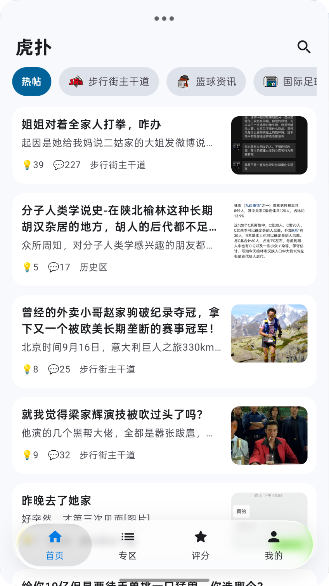<br/>手机</td>
    <td align="center">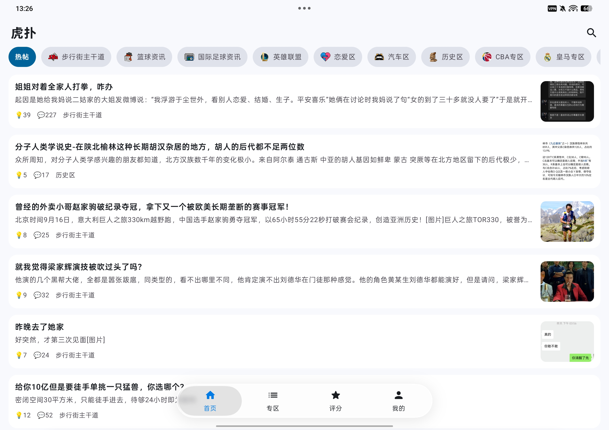<br/>平板</td>
  </tr>
</table>

**专区 · 子分区浏览与分区帖子流**

<table align="center">
  <tr>
    <td align="center">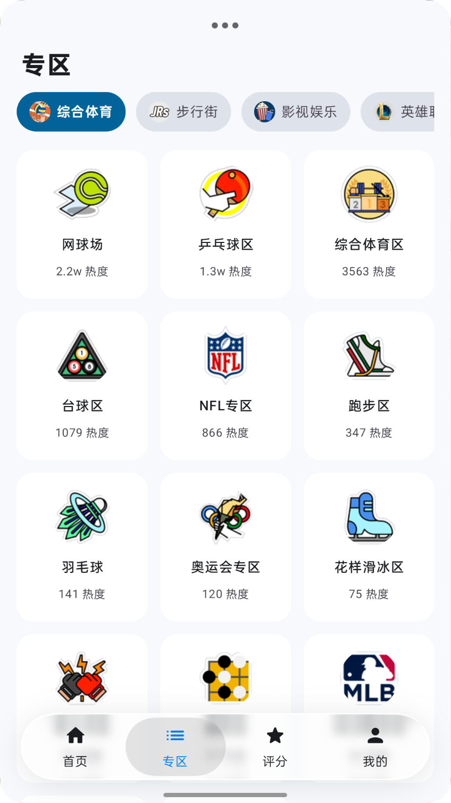<br/>子分区浏览</td>
    <td align="center">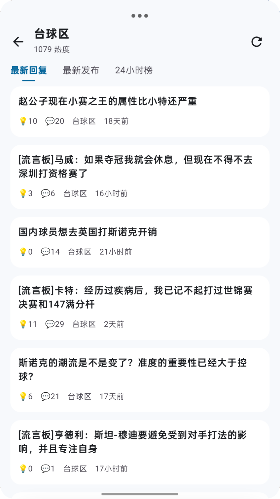<br/>分区帖子流</td>
  </tr>
</table>

**评分 · 主题流 / 赛程 / 对局 / 选手打分**

<table align="center">
  <tr>
    <td align="center">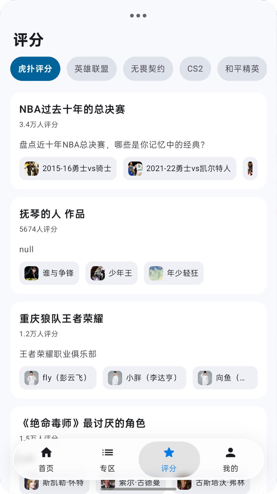<br/>通用评分主题流</td>
    <td align="center">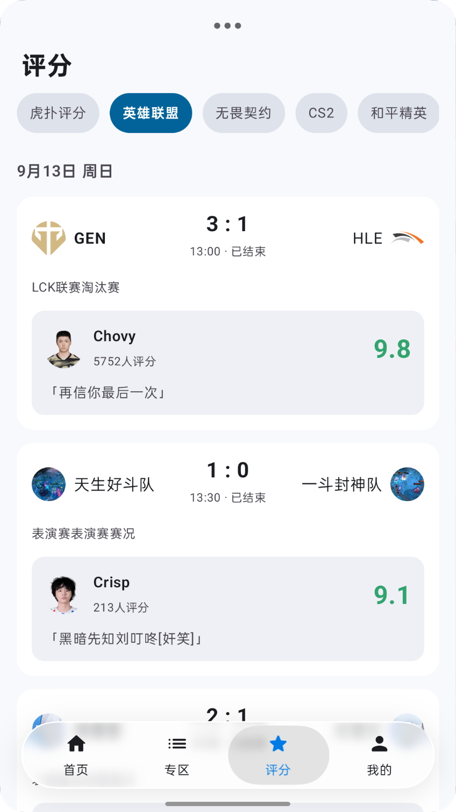<br/>赛事赛程</td>
  </tr>
  <tr>
    <td align="center">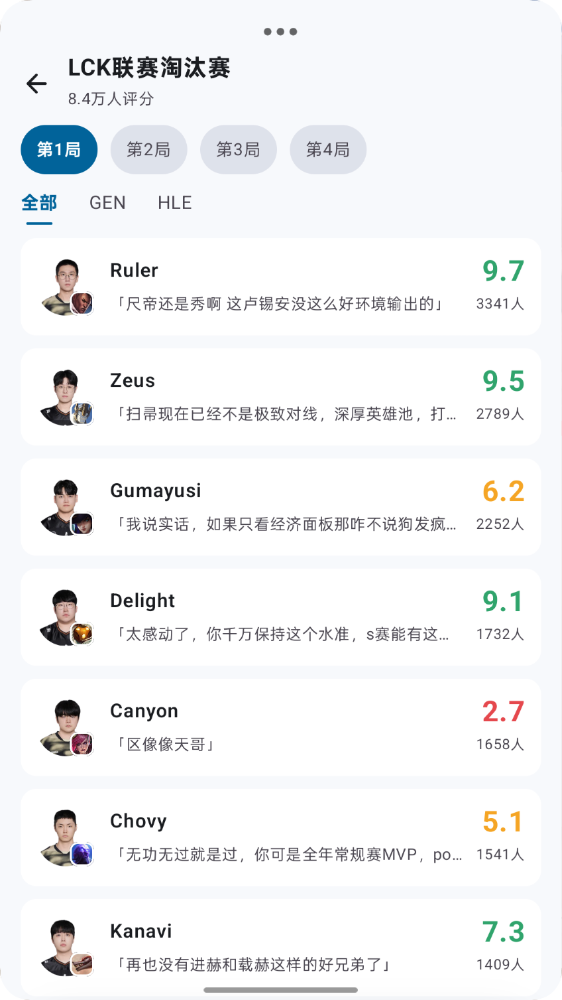<br/>对局详情</td>
    <td align="center">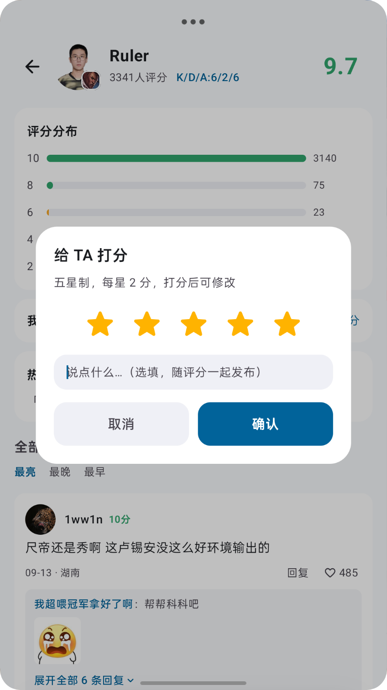<br/>选手详情 · 打分</td>
  </tr>
</table>

**帖子详情 · 图文混排与发帖**

<table align="center">
  <tr>
    <td align="center">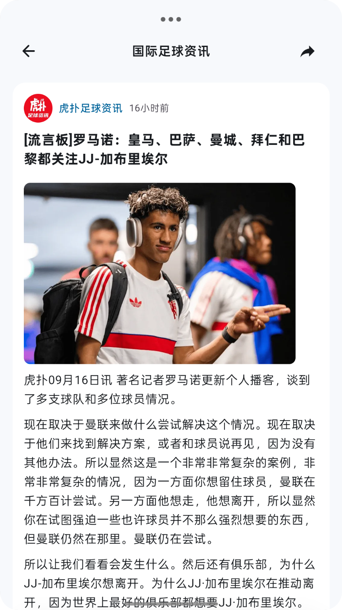<br/>帖子详情</td>
    <td align="center">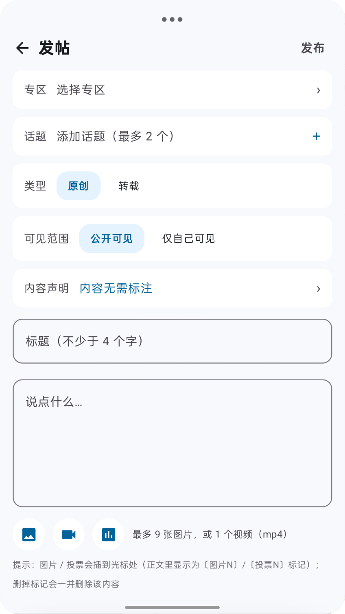<br/>发帖编辑器</td>
  </tr>
</table>

**消息 · 会话列表与聊天**

<table align="center">
  <tr>
    <td align="center">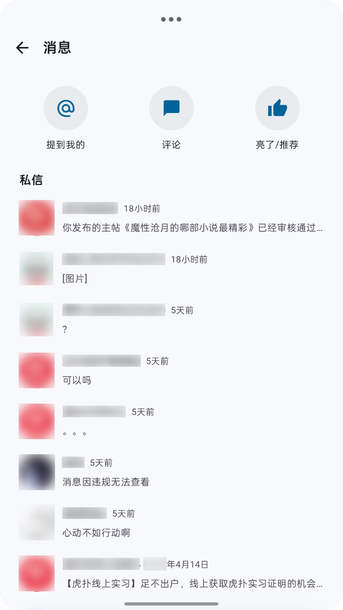<br/>会话列表</td>
    <td align="center">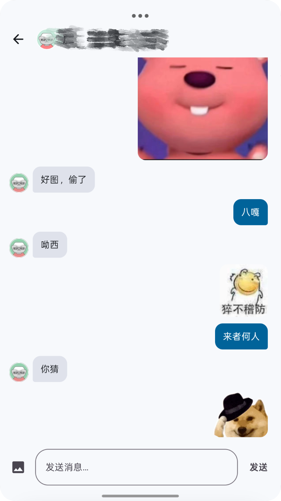<br/>私信聊天</td>
  </tr>
</table>

**用户主页 · 个性化设置**

<table align="center">
  <tr>
    <td align="center">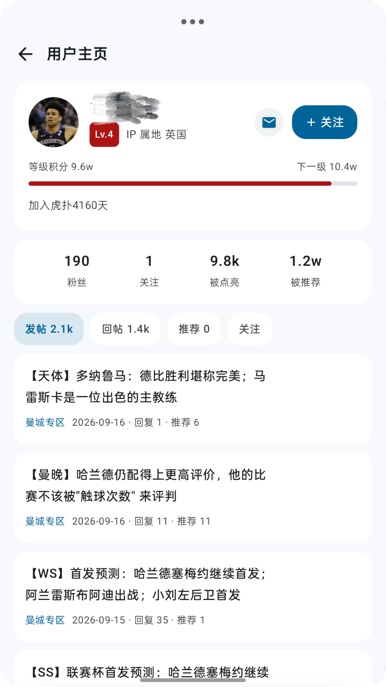<br/>用户主页</td>
    <td align="center">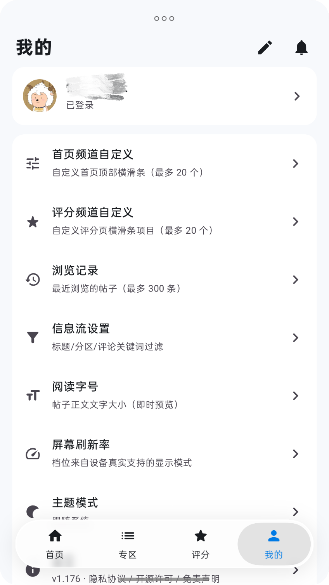<br/>个性化设置</td>
  </tr>
</table>

---

## 🧱 技术栈

| 分类 | 选型 |
|---|---|
| 语言 / UI | Kotlin + Jetpack Compose（Material 3） |
| 悬浮毛玻璃 Tab 栏 | 基于 [kyant/AndroidLiquidGlass](https://github.com/Kyant0/AndroidLiquidGlass)（`backdrop` / `capsule` / `shapes`，Apache-2.0） |
| 网络 | OkHttp（SSR HTML + JSON 接口抓取与解析） |
| 图片 / 视频 | Coil · Media3 ExoPlayer |
| 构建 | Gradle Version Catalog（AGP 9.1 / Kotlin 2.3） |
| 兼容 | minSdk 24 · targetSdk 35 · compileSdk 37 |

---

## 🚀 构建

环境要求：**JDK 17+**、Android SDK。

```bash
./gradlew assembleDebug        # 调试包
./gradlew testDebugUnitTest    # 单元测试
./gradlew assembleRelease      # 正式包（需自备签名配置，见下）
```

产物路径：`app/build/outputs/apk/<variant>/app-<variant>.apk`

> **正式包说明**：`app/build.gradle.kts` 的 `signingConfig` 从仓库根 `keystore.properties` 读取
> （该文件与 `keystore/` 均**不入库**）。clone 后若不提供 `keystore.properties`，`assembleRelease`
> 仍产出**未签名包**；自备 keystore 并创建该文件后即可得到可安装的正式签名包。

---

## 📥 下载

可在 **[Releases](https://github.com/Kanezikiiu/Huzai/releases)** 页面下载正式签名版。

最新版本：**[v1.190](https://github.com/Kanezikiiu/Huzai/releases/tag/v1.190)** ·
[`huzai-1.190-release.apk`](https://github.com/Kanezikiiu/Huzai/releases/download/v1.190/huzai-1.190-release.apk)（minSdk 24，正式签名）。

---

## 📂 项目结构

```
app/src/main/java/com/java/myapplication/
├── MainActivity.kt          # 四 Tab 常驻 + 盖入式转场 + 主题应用
├── HupuApp.kt               # Application（Coil ImageLoader / debug 崩溃取证）
├── data/                    # 数据层：Api / Parser / Repository / 账号 / 缓存 / 偏好 / 图片 / 节流
└── ui/
    ├── pages/               # 各页面（首页 / 专区 / 评分 / 我的 / 帖子详情 / 私信 / 用户主页…）
    ├── components/          # 通用组件与自绘图标
    ├── glass/               # 悬浮毛玻璃 Tab 栏（基于 kyant AndroidLiquidGlass）
    └── theme/               # 主题（浅色 / 深色）
tools/                       # 图标生成、临时脚本等
```

---

## 🔐 数据与隐私

- 登录凭据（Cookie）**仅保存在本机**，不向任何第三方服务器上传。
- 应用**不收集**用户个人信息，无统计 / 埋点 SDK。
- 已关闭全局明文 HTTP：`network_security_config.xml` 仅放行虎扑自有域名。
- 登录凭据已从系统自动备份中排除。

---

## 📄 许可证

本项目基于 **GNU General Public License v3.0** 开源，详见 [LICENSE](LICENSE)。

> 依据 GPL-3.0：你可以自由使用、修改、分发本项目，但**衍生作品须同样以 GPL-3.0 开源**，
> 且不得附加额外限制。

---

## 🙏 致谢

- [Jetpack Compose](https://developer.android.com/jetpack/compose) · [OkHttp](https://square.github.io/okhttp/) · [Coil](https://coil-kt.github.io/coil/) · [Media3](https://developer.android.com/media/media3)
- [kyant/AndroidLiquidGlass](https://github.com/Kyant0/AndroidLiquidGlass) —— 悬浮毛玻璃 Tab 栏所依赖的毛玻璃引擎（`backdrop` / `capsule` / `shapes`，Apache-2.0）

---

## 💬 反馈

欢迎通过 **Issues** 提交问题或建议。

> 本项目为个人学习作品，**不接受**任何形式的商业合作；也请勿将其用于违反虎扑服务条款或相关法律的用途。
